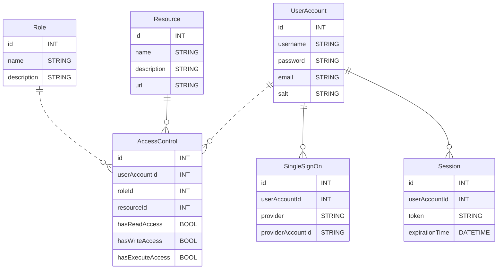

```mermaid
erDiagram
  UserAccount {
    id INT
    username STRING
    password STRING
    email STRING
    salt STRING
  }

  Role {
    id INT
    name STRING
    description STRING
  }

  Resource {
    id INT
    name STRING
    description STRING
    url STRING
  }

  AccessControl {
    id INT
    userAccountId INT 
    roleId INT
    resourceId INT
    hasReadAccess BOOL
    hasWriteAccess BOOL
    hasExecuteAccess BOOL
  }

  SingleSignOn {
    id INT
    userAccountId INT
    provider STRING
    providerAccountId STRING
  }

  Session {
    id INT
    userAccountId INT
    token STRING
    expirationTime DATETIME
  }

  UserAccount ||..o{ AccessControl : ""
  Role ||..o{ AccessControl : ""
  Resource ||--o{ AccessControl : ""
  UserAccount ||--o{ SingleSignOn : ""
  UserAccount ||--o{ Session : ""
```
